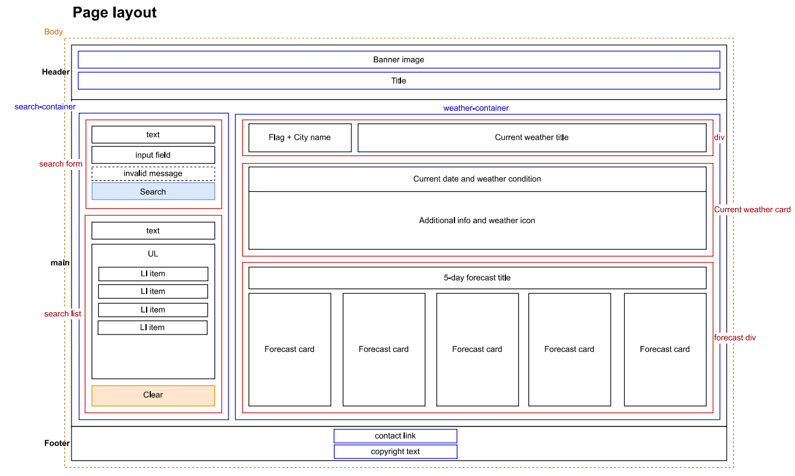
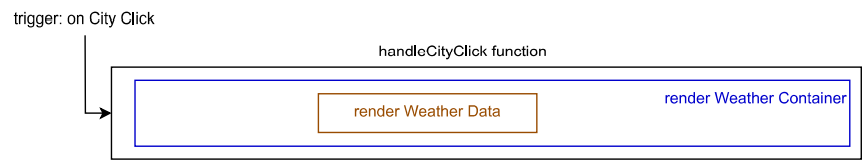
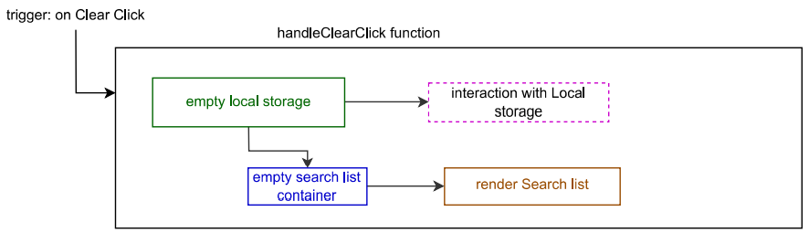
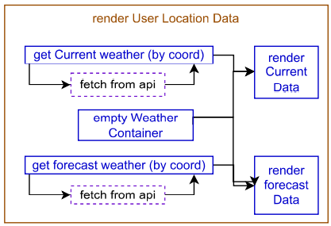
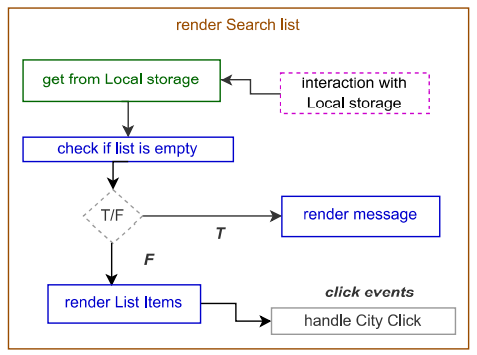
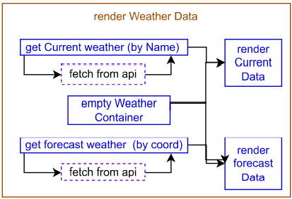

# weather-dashboard

This project is about developing a weather app which allows you to search for a city by name and see the current weather and the 5 day forecast for that city.
This project uses the OpenWeatherMap API to gather the city's current weather data and forecast data.

Deployed URL : [ https://am0031.github.io/weather-dashboard/](https://am0031.github.io/weather-dashboard/)

Github repository URL : [https://github.com/Am0031/weather-dashboard](https://github.com/Am0031/weather-dashboard)

## User journey

When opening the page, the user is presented with a search form and search history list on the left, and their location's weather data on the right.
The user can use the search form to look for a city by name. When they submit the form, the right hand side of the page updates with the weather data of the submitted city. This city is also saved to local storage and added to the user's search list and appears in the updated search history. If the user wants to view the weather data for one of their search history cities, they can click on the city name and the weather data section is updated accordingly.
When the user clicks on the clear button under the search history list, the local storage is cleared and the search history section is updated to display a message indicating that there is no search history.

## Steps followed for the development of the page

To tackle this project, the following steps were taken:

- work out the desired layout of the page
- identify the required APIs to gather the data and their required parameters
- draft general logic of the page and translate it in pseudo code
- develop the functional code with the jQuery library, and using async/await and try/catch syntax for the functions awaiting and using the API's response

## Technologies

This project uses the following technologies:

- Core structure with HTML, CSS and Javascript files
- Styling done using Bootstrap, Google fonts, Fontawesome and author CSS stylesheet
- Functionalities written using jQuery library
- Information gathered from 3 API: [geolocation-db](https://geolocation-db.com/), [openweathermap](https://openweathermap.org/api) and [countryflagsapi](https://www.countryflagsapi.com/)
- Interaction with APIs handled using async/await function type and fetch function

While looking into how to use APIs, the [OpenWeatherMap website](https://openweathermap.org/api) was the main source of information, providing clear documentation on which url to use and example responses for each type of call. In addition, MDN is always a great website to get started with the [async/await function structure](https://developer.mozilla.org/en-US/docs/Web/JavaScript/Reference/Operators/async_function) and the [fetch function](https://developer.mozilla.org/en-US/docs/Web/API/Fetch_API/Using_Fetch).

## Project's wireframe

See below the general layout of the page:

## General logic of the page and Functionalities

The following diagrams show the logic of the page for on load event and click events:

On load of page

On click of search form

On click of city name in search history list

On click of clear button under search history

Additional details for key functions

A full print out of the logic is available [here](./weather-dashobard-wireframe-logic.pdf)

## Controls and limitations put in places

For a better user journey, it is important to integrate certain controls and limitations which are:

- getting the user location from IP address: this method does not require to ask for user permission to access their location and ensures that the page is much more likely to render with weather data instead of the error message
- checking the validity of the user input: making sure it is not empty or does not contain numbers or special characters before submission to the API
- trimming the user input for any unnecessary spaces: making sure the input is clean before submitting it or saving it into local storage
- checking if the user input already exists in local storage : this helps avoid saving duplicate city names and helps keep the search history list clean
- clearing the user input field after submission, so that the field is ready for the next search

## Future development and possible improvements

Currently, the page offers a search by city name, but does not offer a country selection. As a result, the user might be presented with a city's weather matching the city name but located in the wrong country.
When the country is not provided for the API call, the API may arbitrarily direct the user to a US town with the same name. Allocation may be based on popularity and prioritising certain continents. For more accuracy, it would be best to add a second user input where they can select the country, and add this parameter into the API call.
